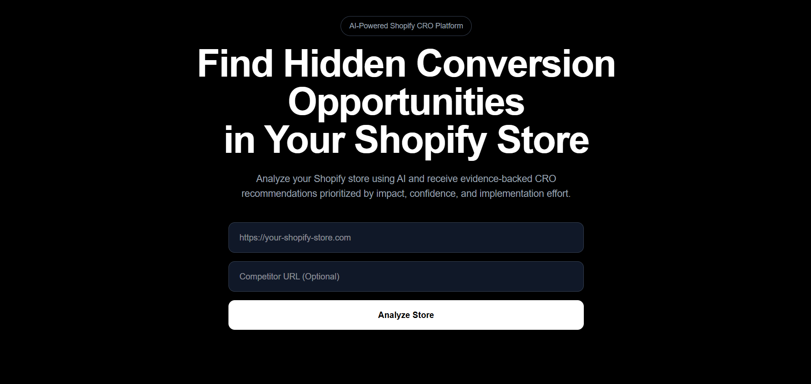
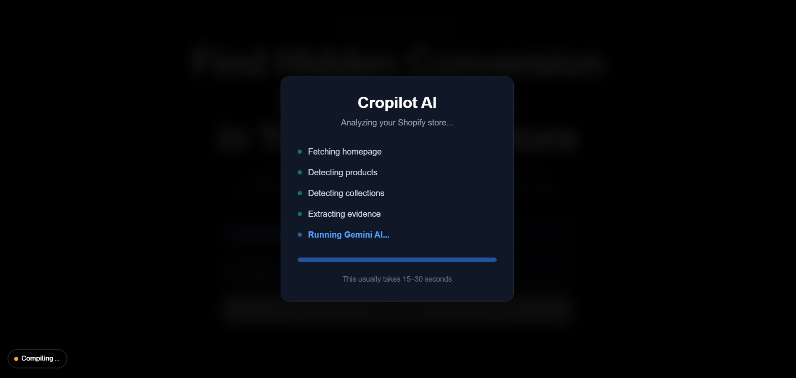
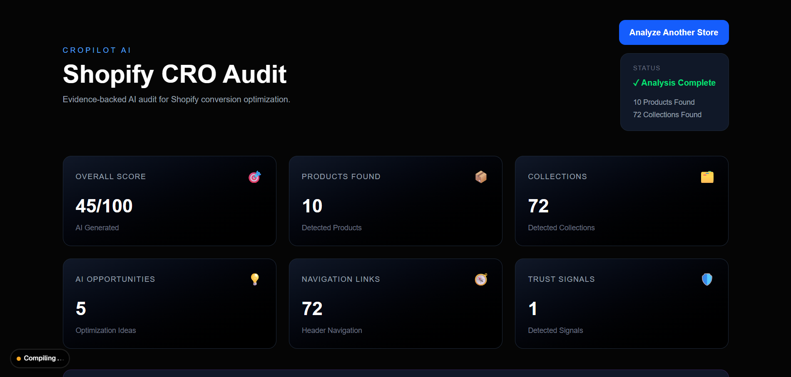
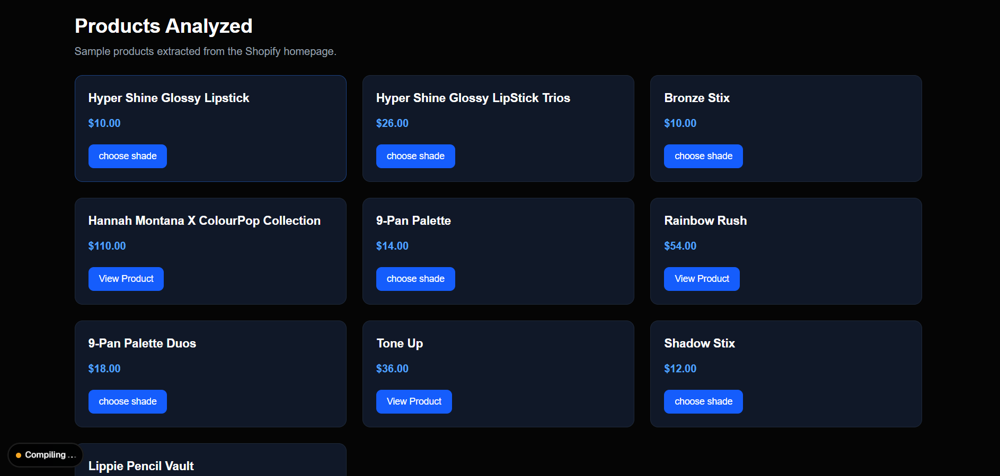

# 🚀 Cropilot AI

An AI-powered Shopify Conversion Rate Optimization (CRO) auditing platform built using **Next.js**, **TypeScript**, **Google Gemini AI**, and **Cheerio**.

Cropilot analyzes Shopify stores by scraping publicly available storefront data, extracting conversion-related evidence, and generating AI-powered recommendations to improve user experience and conversion rates.

---

## 🌐 Live Demo

🔗 **Website:** https://cropilot-j2b7bw82x-projecto6.vercel.app/https://cropilot-j2b7bw82x-projecto6.vercel.app/

> Replace the above URL with your deployed Vercel URL.

---

# 📖 Overview

Cropilot helps Shopify store owners identify conversion optimization opportunities using Artificial Intelligence.

The application:

- Accepts any Shopify store URL
- Scrapes the storefront
- Extracts homepage evidence
- Detects products and collections
- Sends structured evidence to Google Gemini AI
- Generates an AI-powered CRO report
- Displays the audit in a modern dashboard

---

# ✨ Features

### 🤖 AI Features

- AI-powered CRO Audit
- Executive Summary
- Overall CRO Score
- Opportunity Prioritization
- AI-generated Recommendations

### 🛍 Shopify Analysis

- Homepage Analysis
- Product Detection
- Collection Detection
- Navigation Analysis
- Trust Signal Detection

### 📊 Dashboard

- KPI Dashboard
- Product Panel
- Collection Panel
- Evidence Panel
- Opportunity Grid
- Priority Recommendations

### ⚙ Backend

- Website Scraping
- HTML Parsing
- Shopify Detection
- JSON-LD Extraction
- Gemini AI Integration
- Structured API Response

---

# 🛠 Tech Stack

## Frontend

- Next.js 16
- React
- TypeScript
- Tailwind CSS

## Backend

- Next.js API Routes
- Axios
- Cheerio

## AI

- Google Gemini 2.5 Flash

## Deployment

- Vercel

---

# 🏗 Project Architecture

```text
                User
                  │
                  ▼
        Enter Shopify URL
                  │
                  ▼
          Website Scraper
                  │
                  ▼
        Evidence Extraction
                  │
      ┌───────────┼───────────┐
      ▼           ▼           ▼
 Homepage     Products    Collections
      │           │           │
      └───────────┼───────────┘
                  │
                  ▼
          Google Gemini AI
                  │
                  ▼
         AI CRO Audit Report
                  │
                  ▼
        Interactive Dashboard
```

---

# 📂 Project Structure

```text
cropilot/

├── app/
│   ├── api/
│   ├── dashboard/
│   └── page.tsx
│
├── components/
│   ├── dashboard/
│   └── landing/
│
├── lib/
│   ├── ai/
│   └── scraper/
│
├── services/
├── types/
├── public/
├── package.json
└── README.md
```

---

# ⚙ Installation

Clone the repository.

```bash
git clone https://github.com/sagar7121/cropilot.git
```

Move into the project.

```bash
cd cropilot
```

Install dependencies.

```bash
npm install
```

Create a `.env.local` file.

```env
GEMINI_API_KEY=YOUR_GEMINI_API_KEY
```

Run the development server.

```bash
npm run dev
```

Open:

```
http://localhost:3000
```

---

# 🚀 Production Build

Create a production build.

```bash
npm run build
```

Start the production server.

```bash
npm start
```

---

# 📸 Screenshots

## Landing Page



## Loading Screen



## Dashboard



## Product Analysis




# 🚀 Future Enhancements

- Competitor Store Comparison
- Audit History
- Authentication
- PDF Report Export
- Screenshot-Based Analysis
- Historical Performance Tracking
- Multi-page Store Auditing
- AI Chat Assistant
- Performance Benchmarking

---

# 📚 Learning Outcomes

This project demonstrates practical experience with:

- Full Stack Development
- Next.js App Router
- TypeScript
- REST API Development
- AI Integration
- Prompt Engineering
- Web Scraping
- HTML Parsing
- Data Processing
- Responsive UI Development
- Dashboard Design

---

# 👨‍💻 Author

Sagar N

B.Tech – Computer Science & Engineering

Saveetha School of Engineering

GitHub:
https://github.com/sagar7121

LinkedIn:
https://www.linkedin.com/in/sagarn7121/

---

# 📄 License

This project is licensed under the MIT License.

---

⭐ If you found this project useful, consider giving it a star on GitHub!